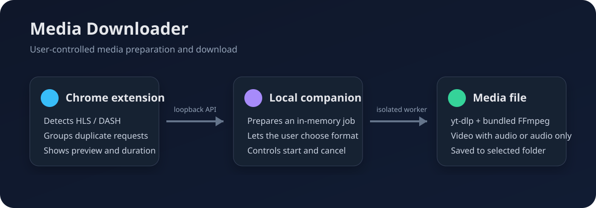

# Media Downloader 0.5

[English](README.md) · Русский

Локальное Windows-приложение и расширение Chrome для подготовки и скачивания доступных пользователю медиа. Проект поддерживает активные HLS/DASH-потоки во встроенных плеерах и ссылки на платформы, которые распознаёт `yt-dlp`.

> Проект не обходит DRM, платный доступ, приватность и региональные ограничения. Сохраняйте только материалы, на которые у вас есть права.



## Возможности

- обнаружение HLS/DASH в Chrome и объединение технических дублей в одну карточку;
- превью, длительность и разрешение до начала загрузки;
- выбор разрешения либо режима «только аудио» для ссылок;
- передача cookies браузера напрямую в `yt-dlp` без их сохранения приложением;
- отмена в отдельном процессе с очисткой новых `.part`, `.part-Frag*` и `.ytdl`;
- открытие Проводника с выделением готового файла;
- сохранение выбранной папки между запусками.

## Требования

- Windows 10/11;
- Chrome 102 или новее;

FFmpeg предоставляется пакетом `imageio-ffmpeg`.

## Быстрый запуск

1. Запустите `MediaDownloader.exe` из корневой папки проекта. Не перемещайте соседнюю папку `_internal`. Устанавливать Python не требуется.
2. Откройте `chrome://extensions` и включите режим разработчика.
3. Нажмите «Загрузить распакованное расширение» и выберите папку `browser-extension`.
4. Запустите видео, откройте расширение и нажмите «Добавить в приложение».
5. Выберите формат в приложении и нажмите «Начать загрузку».

Для YouTube, TikTok, VK, Instagram, Facebook, X, Reddit и Vimeo расширение передаёт URL текущей страницы. Для сайтов со встроенными плеерами оно показывает обнаруженные независимые потоки. Фактическая поддержка конкретной платформы зависит от текущей версии `yt-dlp`, доступности контента и авторизации.

## Приватность и локальная связь

Приложение слушает только `127.0.0.1:17843`. Оно сохраняет лишь выбранную папку загрузки. История задач, URL, cookies, заголовки и превью не записываются в настройки. Подробнее: [модель безопасности](docs/security.md).

## Разработка

Для сборки из исходников требуется Python 3.12 или новее; Node.js 24 или новее используется для проверок расширения.

```powershell
py -3.12 -m venv .venv
.\.venv\Scripts\python.exe -m pip install -r requirements-dev.txt
npm ci
.\.venv\Scripts\python.exe -m unittest discover -s tests -p "test_*.py"
npm test
./build.ps1
```

Папочная сборка создаётся в `dist/MediaDownloader`, затем `MediaDownloader.exe` и `_internal` копируются в корень проекта. `run.bat` остаётся вспомогательным запуском из исходного кода для разработчиков.
Успешные запуски GitHub Actions также публикуют эту папку как скачиваемый артефакт `MediaDownloader-windows-*`.

Все проверки описаны в [docs/testing.md](docs/testing.md), устройство проекта — в [docs/architecture.md](docs/architecture.md). История задачи и результат для портфолио находятся в [docs/case-study.md](docs/case-study.md).

## Ограничения

- DRM-защищённые потоки не поддерживаются.
- Подписанные CDN-ссылки могут истечь; тогда поток нужно снова запустить в Chrome.
- Сетевые платформы меняют API и разметку, поэтому поддержку обеспечивает обновляемый `yt-dlp`.
- Расширение загружается вручную и не опубликовано в Chrome Web Store.

## Лицензия

[MIT](LICENSE) © 2026 Relatoxin.
