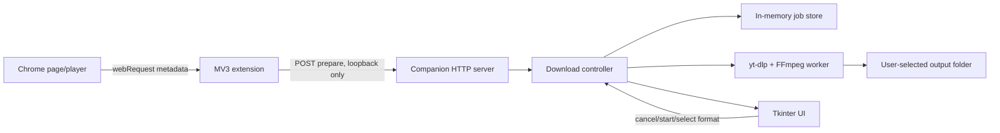

# Architecture

Media Downloader separates browser observation, local orchestration, and extraction so that web pages never launch a download directly.



## Components

- `browser-extension/background.js` records candidate requests and maintains badge state.
- `browser-extension/media-utils.js` identifies the active candidate, groups related HLS playlists, and builds privacy-reduced diagnostics.
- `browser-extension/popup.js` captures player metadata/preview and sends a prepared task.
- `media_downloader/server.py` exposes a small loopback API and sanitizes untrusted payloads.
- `media_downloader/controller.py` owns the prepare/start/cancel lifecycle.
- `media_downloader/job_store.py` keeps newest-first in-memory tasks and enforces a single active download.
- `media_downloader/engine.py` configures `yt-dlp`, performs downloads in an isolated process, invokes bundled FFmpeg, validates outputs, and cleans partial files.
- `app.py` renders the Tkinter UI and marshals background events onto the UI thread.

## Task lifecycle

```text
ANALYZING -> READY -> DOWNLOADING -> COMPLETED
     |                    |
     +------> FAILED <----+
                          +-> CANCELLED
```

Captured active variants can enter `READY` with one confirmed format. Page URLs are analyzed before the user chooses video quality or audio-only output. Jobs are intentionally not persisted; only the output directory is stored.

## Trust boundaries

The extension and all site data are untrusted input. The companion accepts requests only on loopback, requires `X-Media-Helper: 1`, limits request size, validates URLs, filters headers, and allows CORS only for Chrome extension origins. Download paths are resolved under the selected output directory.

